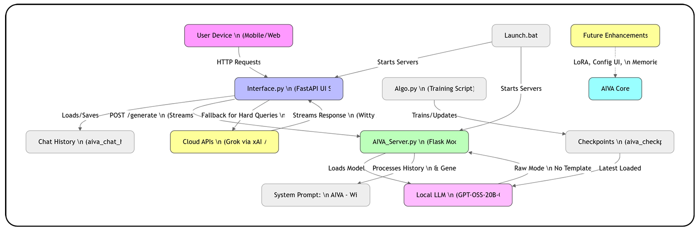

# William Conner Barry
**Senior Analytics Leader | BI & Data Strategy | Inventor | AI Prototyper**

Melbourne, FL  
[LinkedIn](https://www.linkedin.com/in/william-conner-barry-7755a977/) | connerbarry6@gmail.com

## About
Results-driven senior analytics leader with 8+ years architecting enterprise-scale BI and AI solutions. Primary inventor of two patented optimization systems delivering **$150M+ in annual labor savings**. Expert at bridging traditional BI platforms (Power BI, Snowflake, SQL, dbt) with modern AI (Python, PyTorch, LLMs, RAG) to drive measurable business outcomes.

## Key Projects

### AI Boardroom - Multi-Agent Business Intelligence System
**Automated executive-level analysis using real AI agents**

A LinkedIn business intelligence system where AI executives (CFO + CMO) analyze real engagement data and provide strategic recommendations.

**What it does:**
- **Real LinkedIn Data**: Parses 1,281+ interactions (connections, messages, posts) from exported LinkedIn data
- **Engagement → Cash Model**: Converts each interaction type into revenue (DMs=$500, Connections=$50, etc.)
- **Time-Based P&L**: Calculates daily profit/loss with event-based variable costs and fixed daily costs
- **AI Executive Analysis**:
  - **CFO (Gemini 2.5)**: Financial health, cost optimization, margin analysis
  - **CMO (Grok 3)**: Marketing strategy, channel performance, content recommendations
  - **CEO (Strategic AI)**: Synthesizes insights into quarterly OKRs and action plans

**Current Business Metrics** (from real data):
- 1,281 LinkedIn interactions analyzed
- $8,650 monthly revenue generated
- 61% profit margin (AI-calculated)
- 97% ROI on direct messages (top channel)

**Tech Stack**: Python, Gemini 2.5 API, Grok 3 API, LinkedIn Data Export, SQLite, REST APIs, time-series P&L analysis

<iframe src="ai_boardroom_embed.html" width="100%" height="800px" style="border: none; border-radius: 12px; box-shadow: 0 4px 20px rgba(0,0,0,0.15);"></iframe>

### AIVA - Hybrid AI Agent
Solves the personality vs. accuracy trade-off in Large Language Models using a hybrid architecture:  
- Gemini API for high-level reasoning and orchestration  
- Locally-trained NanoGPT model for consistent personality ("Soul")  
- Deterministic Dijkstra-based Knowledge Graph for factual retrieval  

[View Repo →](https://github.com/connerbarry/chloe-hybrid-agent)  
### AIVA - Hybrid AI Agent (AIVA Architecture)
Solves personality vs. accuracy trade-off in LLMs.

<iframe src="aiva_architecture.html" width="100%" height="800px" style="border: none; border-radius: 12px; box-shadow: 0 4px 20px rgba(0,0,0,0.15);"></iframe>
 
  

**Tech stack**: Python, PyTorch, Gemini API, RAG, NanoGPT

### AgentAnalyze - Local Agentic RAG System
Locally-run agentic AI system that ingests personal documents and answers questions using multi-step reasoning:

- Direct GGUF model loading via llama-cpp-python — no server, no API dependency
- Semantic search over document collections using ChromaDB vector store
- ReAct-style agent loop with tool selection (search, read file, list files)
- Dual-mode operation: fast single-pass RAG and multi-step agentic reasoning
- Automated document ingestion supporting PDF, DOCX, CSV, and TXT formats
- Runs entirely on CPU with no GPU — optimized for resource-constrained hardware

**Tech stack**: Python, llama-cpp-python, ChromaDB, Mistral 7B (GGUF Q4), PyMuPDF, ReAct pattern

### Retail Analytics Pipeline (Snowflake + dbt + Power BI)
End-to-end retail analytics pipeline built on the Superstore dataset:  
- dbt staging and marts for data cleaning and derivation (net sales, return flags)  
- Snowflake Cortex AI for product/category sentiment scoring  
- Interactive Power BI dashboards with quantity trends, geographic insights, and AI-enhanced analysis  

[View Repo →](https://github.com/connerbarry/retail-analytics-pipeline)  

### Multi-Format PDF Invoice Parser
Enterprise-scale document processing system for automated data extraction from variant PDF formats:
- Adaptive pattern matching handling 10+ invoice layout variations
- Fuzzy description mapping to standardized taxonomy
- Multi-entity extraction (dates, amounts, line items, account details)
- Preserves Excel template structure including formulas and formatting
- Processes 50+ invoices monthly with 99%+ accuracy

**Impact**: Eliminated manual data entry for monthly financial consolidation workflow - (5 minutes per invoice to 0)

**Tech stack**: Python, pdfplumber, pandas, openpyxl, regex, fuzzy matching

<iframe src="ai-price-router.html" width="100%" height="800px" style="border: none; border-radius: 12px; box-shadow: 0 4px 20px rgba(0,0,0,0.15);"></iframe>

## Download Resume
[Full Resume (PDF)](William_Barry_Resume_022026_v2.pdf)

## Let's Connect
Open to Director-level opportunities in Analytics, BI, Data Strategy, or AI-augmented leadership.  
connerbarry6@gmail.com | [LinkedIn](https://www.linkedin.com/in/william-conner-barry-7755a977/)
