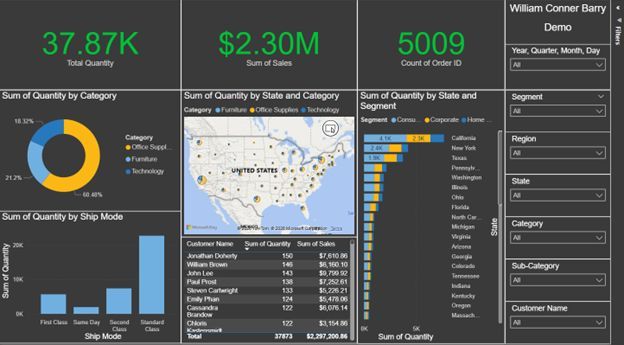

# Conner Barry
Senior Analytics Leader | Director of BI & Data Strategy | Inventor

Melbourne, FL | [LinkedIn](https://www.linkedin.com/in/william-conner-barry-7755a977/) | connerbarry6@gmail.com

## About
Results-driven leader with patented systems delivering $150M+ savings. Bridging enterprise BI (Power BI, Snowflake, SQL) with AI (Python, PyTorch, LLMs).

## Key Projects

### Chloe - Hybrid AI Agent
Solves personality vs. accuracy trade-off in LLMs using Gemini orchestration + local NanoGPT "Soul" + Dijkstra Knowledge Graph.  
[View Repo →](https://github.com/connerbarry/chloe-hybrid-agent)  
  
Tech: Python, PyTorch, Gemini API, RAG

### Retail Analytics Pipeline (Snowflake + dbt + Power BI)
Full-stack pipeline on Superstore data: dbt staging/marts, Snowflake Cortex AI sentiment scoring, interactive dashboards.  
[View Repo →](https://github.com/connerbarry/retail-analytics-pipeline)  

## More
Full resume: [PDF Link]  
Contact: connerbarry6@gmail.com
